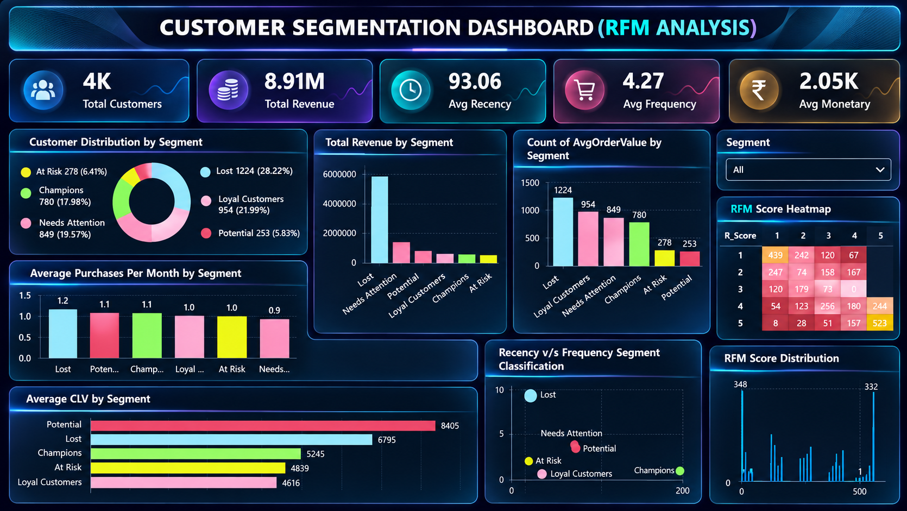

# **Customer RFM Segmentation Project**

---

## **Executive Summary**

This project performs **end-to-end customer segmentation** using the **RFM (Recency, Frequency, Monetary)** framework, enriched with **Customer Lifetime Value (CLV)** analysis.

The objective is to help businesses **identify high-value customers, loyal buyers, potential growth segments, at-risk customers, and churned customers**, enabling more focused retention and marketing strategies.

The project follows a **real-world analytics workflow** — **SQL → Python → SQL → Python → Power BI** — similar to processes used in e-commerce and retail organizations.

---

## **Why I Built This Project**

Many businesses treat all customers the same, without understanding:
- Which customers generate the most revenue
- Who buys frequently vs. occasionally
- Which customers are likely to churn
- Where marketing spend actually delivers value

This leads to **inefficient marketing spend, poor retention, and revenue loss**.

I built this project to demonstrate how **data-driven customer segmentation** can directly support **better business decisions**, especially around retention and growth.

---

## **Business Context**

In e-commerce and retail:
- Customer acquisition is expensive
- Retention is more cost-effective than acquisition
- Not all customers contribute equally to revenue

The business needs clarity on:
- Customer value distribution
- Loyalty and repeat purchase behavior
- Churn risk and future revenue potential

RFM and CLV analysis provide a structured way to answer these questions.

---

## **Problem Statement**

Analyze transactional customer data to segment customers based on **Recency, Frequency, and Monetary value**, enrich the segmentation with **Customer Lifetime Value**, and provide actionable insights to improve **retention, targeting, and marketing efficiency**.

---

## **Hypotheses**

Before analysis, the following hypotheses were framed:

- **H1:** A small percentage of customers contribute the majority of revenue  
- **H2:** Loyal customers purchase more frequently and have higher CLV  
- **H3:** Recently inactive customers present a higher churn risk  
- **H4:** Some low-frequency customers still show high future value  

These hypotheses guided the segmentation and analysis process.

---

## **Dataset Overview**

- **Dataset Source:** Kaggle – Retail Insights Dataset  
- **Dataset Link:**  
  https://www.kaggle.com/datasets/rajneesh231/retail-insights-a-comprehensive-sales-dataset  

- **Level of Analysis:** Customer-level  
- **Data Type:** Transactional sales data  

---

## **End-to-End Workflow**

**Workflow Used:**  
**SQL → Python → SQL → Python → Power BI**

### **1. SQL — Raw Table Setup**
- Created transactional tables  
- Validated raw data structure  
- Prepared data for preprocessing  

### **2. Python — Data Cleaning and Export**
- Removed duplicate records  
- Handled missing values  
- Standardized date formats  
- Exported cleaned data back to SQL  

### **3. SQL — RFM Calculation & Segmentation**
- Calculated **Recency, Frequency, Monetary** metrics  
- Assigned **NTILE-based scores (1–5)**  
- Created customer segments  

### **4. Python — CLV Modeling & Dataset Enrichment**
- Imported RFM output  
- Computed **Customer Lifetime Value (CLV)**  
- Enriched segmentation with retention indicators  
- Exported final dataset for BI  

### **5. Power BI — Dashboard Development**
- Built RFM segmentation dashboard  
- Added CLV-based visuals  
- Created segment-wise KPIs and summaries  

---

## **Dashboard Overview**

The Power BI dashboard provides:
- Customer segmentation overview  
- RFM score distribution  
- CLV comparison across segments  
- Identification of high-value and at-risk customers  

---

## **Key KPIs Tracked**

- **Recency Score**
- **Frequency Score**
- **Monetary Score**
- **Customer Segment**
- **Customer Lifetime Value (CLV)**

---

## **Key Insights**

- **Champions and Loyal customers** generate the majority of revenue  
- **Lost customers** form a large segment but contribute minimal value  
- **Potential customers** show high future value based on CLV  
- Many customers have **low recency**, indicating retention challenges  
- Loyal customers purchase **more frequently** and consistently  
- CLV highlights which segments are **worth investing in**  

---

## **Business Impact**

- Enables targeted marketing instead of mass campaigns  
- Helps reduce churn by identifying at-risk customers early  
- Improves retention strategy through segment-level insights  
- Optimizes marketing spend by focusing on high-value customers  

---

## **Recommendations**

- **Champions:** Retain with exclusive rewards and premium offers  
- **Loyal:** Strengthen loyalty with cross-sell and upsell campaigns  
- **Potential:** Convert with onboarding journeys and targeted discounts  
- **At Risk:** Re-engage with win-back strategies  
- **Needs Attention:** Encourage repeat purchases with incentives  
- **Lost:** Use low-cost outreach only; avoid heavy spending  

**Overall:** Focus marketing budget on **high-value and high-CLV segments**.

---

## **Final Takeaway**

Customer behavior varies significantly across segments.  
Using **RFM + CLV analysis** allows businesses to shift from generic marketing to **data-driven customer intelligence**, improving retention, reducing churn, and maximizing lifetime value.

---

## **Tech Stack**

- **Python** (pandas, numpy, matplotlib, seaborn)  
- **SQL (MySQL)** – segmentation, scoring, aggregation  
- **Power BI** – dashboard creation  
- **Jupyter Notebook** – EDA and modeling  

---
